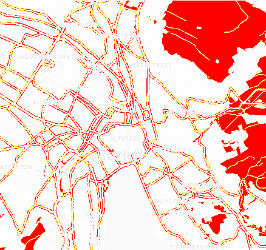
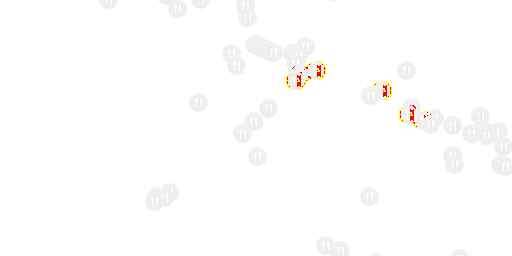
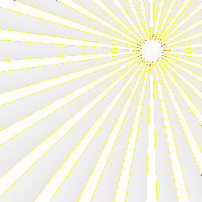

# pixelmatch-cpp17

[](https://github.com/jwmcglynn/pixelmatch-cpp17/actions/workflows/main.yml) [](https://opensource.org/licenses/ISC) [](https://codecov.io/gh/jwmcglynn/pixelmatch-cpp17)

A C++17 port of the JavaScript pixelmatch library, providing a small pixel-level image comparison library.

Features accurate **anti-aliased pixels detection** and **perceptual color difference metrics**.

Based on [mapbox/pixelmatch](https://github.com/mapbox/pixelmatch).  pixelmatch-cpp17 is around **300 lines of code**, and has **no dependencies**, operating on RGBA-encoded buffers.


```cpp
#include <pixelmatch/pixelmatch.h>

pixelmatch::Options options;
options.threshold = 0.1f;

const std::vector<uint8_t> img1 = ...;
const std::vector<uint8_t> img2 = ...;
std::vector<uint8_t> diffImage(img1.size());

const int numDiffPixels = pixelmatch::pixelmatch(img1, img2, diffImage, width, height, stride, options);
```

Compared to [mapbox/pixelmatch-cpp](https://github.com/mapbox/pixelmatch-cpp), pixelmatch-cpp17 ports the latest features from the JavaScript library, and is built with production-grade practices, including thorough test coverage and fuzz-testing.  Build files are included for Bazel and CMake, but contributions for other build systems are welcome.

Implements ideas from the following papers:

- [Measuring perceived color difference using YIQ NTSC transmission color space in mobile applications](http://www.progmat.uaem.mx:8080/artVol2Num2/Articulo3Vol2Num2.pdf) (2010, Yuriy Kotsarenko, Fernando Ramos)
- [Anti-aliased pixel and intensity slope detector](https://www.researchgate.net/publication/234126755_Anti-aliased_Pixel_and_Intensity_Slope_Detector) (2009, Vytautas Vyšniauskas)

## Example output

| expected | actual | diff |
| --- | --- | --- |
|  |  |  |
|  |  |  |
|  |  |  |

## API

### pixelmatch(img1, img2, output, width, height, strideInPixels[, options])

- `img1`, `img2` — Image data of the images to compare, as a RGBA-encoded byte array. **Note:** image dimensions must be equal.
- `output` — Image data to write the diff to, or `std::nullopt` if you don't need a diff image.
- `width`, `height` — Width and height of the images. Note that _all three images_ need to have the same dimensions.
- `strideInPixels` — Stride of the images. Note that _all three images_ need to have the same stride.
- `options` is a struct with the following fields:
  - `threshold` — Matching threshold, ranges from `0.0f` to `1.0f`. Smaller values make the comparison more sensitive. `0.1` by default.
  - `includeAA` — If `true`, disables detecting and ignoring anti-aliased pixels. `false` by default.
  - `alpha` — Blending factor of unchanged pixels in the diff output. Ranges from `0` for pure white to `1` for original brightness. `0.1` by default.
  - `aaColor` — The color of anti-aliased pixels in the diff output as an RGBA color. `(255, 255, 0, 255)` by default.
  - `diffColor` — The color of differing pixels in the diff output as an RGBA color `(255, 0, 0, 255)` by default.
  - `diffColorAlt` — An alternative color to use for dark on light differences to differentiate between "added" and "removed" parts. If not provided, all differing pixels use the color specified by `diffColor`. `std::nullopt` by default.
  - `diffMask` — Draw the diff over a transparent background (a mask), rather than over the original image. Will not draw anti-aliased pixels (if detected).

Compares two images, writes the output diff and returns the number of mismatched pixels.

## Usage

### Bazel

- Bazel 7.0.0 or newer is required for bzlmod.

Add the following to your `MODULE.bazel` file:

```py
bazel_dep(name = "pixelmatch-cpp17", version = "0.0.0")
git_override(
    module_name = "pixelmatch-cpp17",
    remote = "https://github.com/jwmcglynn/pixelmatch-cpp17",
    commit = "<latest commit hash>", # Ex: 2ab1b929916b97668698523a91e752413d01939c
)
```

### CMake

To take a dependency on `pixelmatch-cpp17` with `FetchContent`, add the following
to your project's `CMakeLists.txt`:

```cmake
include(FetchContent)
FetchContent_Declare(
  pixelmatch-cpp17
  GIT_REPOSITORY https://github.com/jwmcglynn/pixelmatch-cpp17.git
  GIT_TAG <commit or tag>
)
FetchContent_MakeAvailable(pixelmatch-cpp17)

target_link_libraries(your_target PRIVATE pixelmatch-cpp17)
```

#### Running the tests


This repository also provides CMake build files.  A typical workflow is:

```sh
cmake -S . -B build -DPIXELMATCH_BUILD_TESTS=ON
cmake --build build
ctest --test-dir build
```

### Calling from C++

In your test file, include pixelmatch with:
```cpp
#include <pixelmatch/pixelmatch.h>
```

Then, you can use the `pixelmatch::pixelmatch` function.

```cpp
// Pass an options struct to configure the comparison. If not specified, defaults will be used.
pixelmatch::Options options;
options.threshold = 0.1f;

// Load two images as RGBA-encoded byte arrays. The images must have the same dimensions and stride.
const std::vector<uint8_t> img1 = ...;
const std::vector<uint8_t> img2 = ...;
// Output image will be saved in this buffer.
std::vector<uint8_t> diffImage(img1.size());

// Pass the image buffers and call with the width, height, and stride of the images.
const int numDiffPixels = pixelmatch::pixelmatch(img1, img2, diffImage, width, height, stride, options);
```

## Projects using pixelmatch-cpp17

- Python bindings: https://github.com/cubao/pybind11_pixelmatch

## Documentation

- [Code Coverage](docs/code_coverage.md)
- [Fuzz Testing](docs/fuzz_testing.md)
