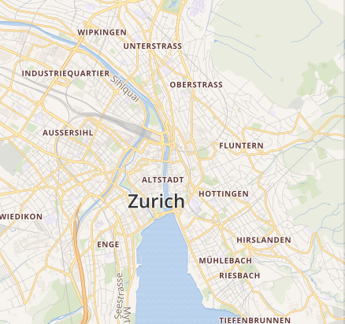
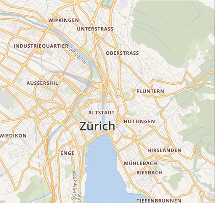
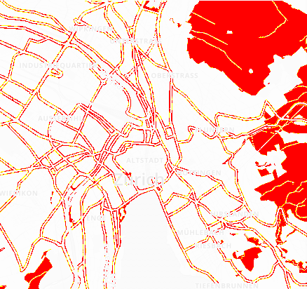
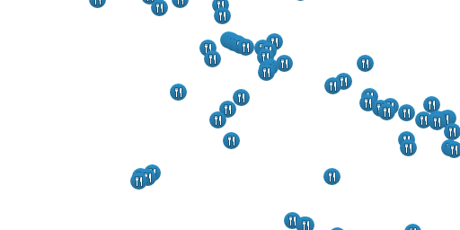
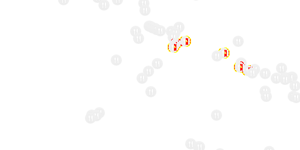

# pixelmatch-cpp17

[](https://github.com/jwmcglynn/pixelmatch-cpp17/actions/workflows/main.yml) [](https://opensource.org/licenses/ISC) [](https://codecov.io/gh/jwmcglynn/pixelmatch-cpp17) [](https://www.codefactor.io/repository/github/jwmcglynn/pixelmatch-cpp17)

A small C++17 port of [pixelmatch](https://github.com/mapbox/pixelmatch) for comparing images pixel by pixel.

The core comparison algorithm is about **340 lines of C++**, excluding comments and blank lines.
It works directly on RGBA buffers, detects anti-aliased edges, and measures perceptual color differences
without external runtime dependencies. Bazel and CMake builds support C++17 and C++20.

```cpp
#include <pixelmatch/pixelmatch.h>
#include <vector>

// Load equally sized RGBA images with the same row stride.
const std::vector<uint8_t> img1 = ...;
const std::vector<uint8_t> img2 = ...;
std::vector<uint8_t> diffImage(img1.size());

pixelmatch::Options options;
options.threshold = 0.1f;

const int mismatches = pixelmatch::pixelmatch(
    img1, img2, diffImage, width, height, strideInPixels, options);
```

The implementation combines [OKLab](https://bottosson.github.io/posts/oklab/) color differences
with toe-corrected lightness and the HyAB distance metric. Anti-aliasing detection is based on
[Vytautas Vyšniauskas's intensity slope detector](https://www.researchgate.net/publication/234126755_Anti-aliased_Pixel_and_Intensity_Slope_Detector).

## Example output

| Expected | Actual | Diff |
| --- | --- | --- |
|  |  |  |
|  |  |  |
|  |  |  |

## API

```cpp
int pixelmatch::pixelmatch(
    pixelmatch::span<const uint8_t> img1,
    pixelmatch::span<const uint8_t> img2,
    pixelmatch::span<uint8_t> output,
    int width, int height, size_t strideInPixels,
    pixelmatch::Options options = {}) noexcept;
```

Compares two images, optionally writes a diff image, and returns the number of mismatched pixels.
When `windowSize` is finite, it returns the largest mismatch count in any square window.

- `img1`, `img2`: RGBA byte buffers with unpremultiplied alpha. Each must contain `strideInPixels * height * 4` bytes.
- `output`: A writable buffer of the same size, or `{}` to skip the diff image. Row padding is left untouched.
- `width`, `height`: Positive image dimensions in pixels. The total pixel count must fit in an `int`.
- `strideInPixels`: The number of pixels between the starts of consecutive rows, including padding. It must be at least `width` and must be the same for all buffers.
- `options`: An optional `pixelmatch::Options` value with the fields below.

Invalid dimensions, stride, or buffer sizes trigger assertions in debug builds and return `-1` in release builds.

| Option | Default | Meaning |
| --- | --- | --- |
| `threshold` | `0.1f` | Matching threshold from `0.0f` to `1.0f`. Lower values detect smaller differences. |
| `includeAA` | `false` | Set to `true` to count anti-aliased pixels as differences and skip anti-aliasing detection. |
| `alpha` | `0.1f` | Opacity of the grayscale background in the diff: `0` gives white; `1` preserves the input's brightness and alpha contribution. |
| `aaColor` | `{255, 255, 0, 255}` | RGBA color for detected anti-aliased pixels. |
| `diffColor` | `{255, 0, 0, 255}` | RGBA color for mismatched pixels. |
| `diffColorAlt` | `std::nullopt` | Optional RGBA color for pixels that are darker in `img2`, to distinguish added and removed content. Otherwise, uses `diffColor`. |
| `diffMask` | `false` | Write only mismatched pixels. Other output pixels remain untouched; zero-initialize the output for a transparent mask. |
| `checkerboard` | `true` | Compare transparent pixels over a checkerboard. Set to `false` to use white. |
| `windowSize` | Positive infinity | Return the largest mismatch count in an N×N window. Finite values are floored and clamped to `[1, min(width, height)]`. NaN and infinities use the total count. |

Windowed comparisons still produce a diff image for the whole image. They use
O(width × height + width) scratch storage; the default comparison allocates none.
If scratch allocation fails, the function returns `-1` and leaves output unchanged.

## Upstream compatibility

This implementation tracks [JavaScript pixelmatch main at `b2800051`](https://github.com/mapbox/pixelmatch/tree/b2800051f2b79d18cf27e51cd240cafd38cfb0ba),
including unreleased OKLab and sliding-window changes beyond JavaScript v7.2.0.

### Updating existing C++ code

Existing calls, `span` types, `Color`, and the original `Options` field types and order are preserved.
New options are appended, so existing aggregate initializers still compile. Strided buffers,
RGBA diff colors, empty output spans, and `noexcept` remain supported.
**Rebuild dependent code when upgrading:** the expanded `Options` struct changes its binary layout.

The new color metric can change mismatch counts, so existing YIQ thresholds and expected diff images
may need adjustment. Setting `checkerboard = false` selects a white background; it does not restore YIQ.

### Differences from JavaScript

- `threshold` and `alpha` keep their existing C++ `float` types. Reference tests pass those exact values to JavaScript.
- The C++ API supports row padding and RGBA output colors, including custom alpha values.
- Checkerboard offsets use unsigned arithmetic to avoid the negative background channels caused by JavaScript's signed 32-bit coercion beyond roughly 3.47 GB.

## Installation

### Bazel

Add the published release to your `MODULE.bazel` file:

```python
bazel_dep(name = "pixelmatch-cpp17", version = "2.0.0")
```

Version 2.0.0 includes the comparison changes described above. Registry versions become available
after their BCR pull request is merged.
For repository builds, use the Bazel version pinned in [`.bazelversion`](.bazelversion).

### CMake

Use `FetchContent` and select the commit or tag you want to build:

```cmake
include(FetchContent)
FetchContent_Declare(
  pixelmatch-cpp17
  GIT_REPOSITORY https://github.com/jwmcglynn/pixelmatch-cpp17.git
  GIT_TAG <commit or tag>
)
FetchContent_MakeAvailable(pixelmatch-cpp17)

target_link_libraries(your_target PRIVATE pixelmatch-cpp17)
```

## Tests and coverage

To build and run the tests with CMake:

```sh
cmake -S . -B build -DPIXELMATCH_BUILD_TESTS=ON
cmake --build build
ctest --test-dir build --output-on-failure
```

CMake defaults to C++17. Add `-DCMAKE_CXX_STANDARD=20` to test with C++20 and `std::span`.

The test suite includes upstream golden images, deterministic comparisons against the pinned JavaScript
implementation, API compatibility tests, and edge cases. CI requires **100% line, region, function,
and branch coverage** across the library implementation and the C++17 span polyfill.

- [Code coverage](docs/code_coverage.md)
- [Fuzz testing](docs/fuzz_testing.md)

## Projects using pixelmatch-cpp17

- [Python bindings](https://github.com/cubao/pybind11_pixelmatch)

## Publishing to the Bazel Central Registry

Stable GitHub releases automatically open an update in the
[Bazel Central Registry](https://registry.bazel.build/modules/pixelmatch-cpp17), using the
release templates in [`.bcr`](.bcr) and the pinned [publishing workflow](.github/workflows/publish-bcr.yml).
The workflow requires a repository secret named `BCR_PUBLISH_TOKEN` with access to the
`jwmcglynn/bazel-central-registry` fork and permission to open a BCR pull request.
Registry publication completes after BCR's checks and review.

Before publishing a release, update the version in `MODULE.bazel`, `CMakeLists.txt`, the downstream
[consumer module](examples/bazel_consumer/MODULE.bazel), and this README. Merge the change to main
and wait for CI and coverage to pass before publishing its `vX.Y.Z` release. The BCR workflow verifies
that the release is published, stable, from main, and version-consistent with successful CI.

The workflow can be dispatched manually for an existing release if needed. It refuses to replace
an existing submission branch in the registry fork; inspect that branch or PR before recovering a
partially completed submission. Creating a tag alone does not submit anything to BCR.

CI generates a registry entry from the source archive, tests it as a separate C++17/C++20 consumer,
and preserves the tested archive as a workflow artifact. Publishing downloads that exact archive from
the successful main CI run and uploads it as `pixelmatch-cpp17-X.Y.Z.tar.gz`. An existing release asset
must match those bytes; the workflow never replaces it.

The test registry uses a local archive URL. The published template uses the stable release asset URL,
which keeps its checksum fixed even if GitHub regenerates its automatic tag archives. Release
publishing requires the CI artifact to remain available; rerun CI for the release commit if it expires.
